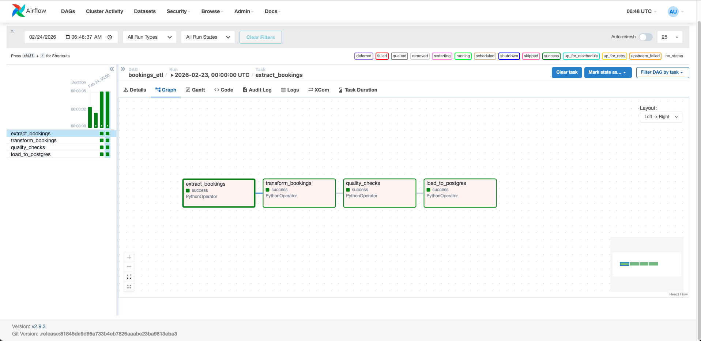
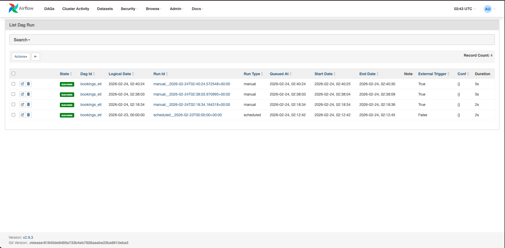

# Travel Bookings Pipeline (Airflow + Postgres)

An end-to-end ETL pipeline orchestrated with Apache Airflow and Docker Compose. The DAG extracts raw hotel booking data, transforms and validates it, then loads an analytics-ready fact table into PostgreSQL.

## Tech Stack
- Apache Airflow (DAG orchestration)
- Docker Compose (local environment)
- PostgreSQL (analytics database)
- Python (Pandas/NumPy) for transformations and validation

## Pipelinen`  
- Password: `admin`

### 3) Trigger the DAG
Trigger `bookings_etl` from the UI.

(Optional CLI)
```bash
docker compose exec airflow-webserver airflow dags trigger bookings_etl
```

## Verify in Postgres

List tables:
```bash
docker exec -it bookings-postgres psql -U bookings -d bookings -c "\dt"
```

Row count:
```bash
docker exec -it bookings-postgres psql -U bookings -d bookings -c "SELECT COUNT(*) FROM fact_bookings;"
```

Date coverage:
```bash
docker exec -it bookings-postgres psql -U bookings -d bookings -c "
SELECT
  COUNT(*) AS rows,
  MIN(arrival_date) AS min_arrival_date,
  MAX(arrival_date) AS max_arrival_date
FROM fact_bookings;"
```

## Sample Insights

Top 10 countries by bookings:
```bash
docker exec -it bookings-postgres psql -U bookings -d bookings -c "
SELECT country, COUNT(*) AS bookings
FROM fact_bookings
GROUP BY country
ORDER BY bookings DESC
LIMIT 10;"
```

Cancellation rate:
```bash
docker exec -it bookings-postgres psql -U bookings -d bookings -c "
SELECT ROUND(100.0 * AVG(CASE WHEN is_canceled THEN 1 ELSE 0 END), 2) AS cancel_rate_pct
FROM fact_bookings;"
```

## Screenshots

### Airflow Graph View 


### Airflow List View 


**DAG:** `bookings_etl`  
**Tasks:** `extract_bookings -> transform_bookings -> quality_checks -> load_to_postgres`  
**Output table:** `public.fact_bookings`

Current dataset results:
- Rows loaded: **119,390**
- Arrival date range: **2015-07-01** to **2017-08-31**
- Cancellation rate: **37.04%**

## How to Run

### 1) Start services
```bash
docker compose up -d --build
```

### 2) Open Airflow UI
- URL: http://localhost:8080  
- Username: `admi
